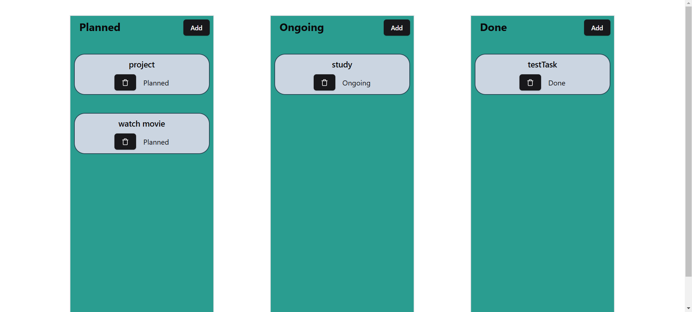

## Canban Board

basic react project built using Zustand and Shadcn UI. 

*(for learning purpose)*

## Features: 

1. draggable tasks.
2. add task in any state.
3. remove task in any state.

### Screenshot

  
